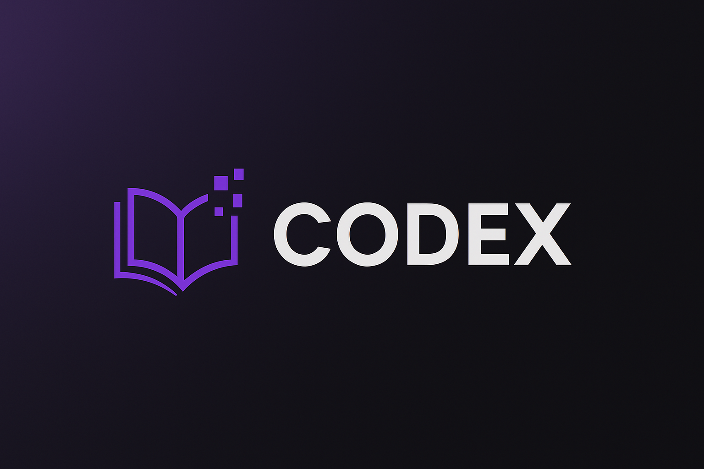

# 📚 Codex Library Management System

A full-featured PHP-based Library Management System for managing books, users, and loans. Built as part of an academic project using XAMPP, MySQL, and VS Code.

<p align="center">
  
</p>

---

## 🔧 Features

✅ User registration & login (Admin and User roles)  
✅ Dark and light mode toggle  
✅ Book browsing, loaning, and returning  
✅ Reserve books and get notified when available  
✅ Admin panel to manage books and users  
✅ Search functionality by title, author, or genre  
✅ Sticky footer with logo and contact info  
✅ Fully responsive and styled with a purple theme  

---

## 🛠️ Technologies Used

- PHP (Core functionality)  
- MySQL (Database)  
- HTML5 & CSS3  
- JavaScript (Theme toggle)  
- XAMPP (Apache + MySQL stack)  
- VS Code (IDE)  

---

## ⚙️ How to Run It Locally

1. Install XAMPP and start Apache & MySQL  
2. Clone the repo into `htdocs`:
   ```bash
   git clone https://github.com/your-username/library-system.git
